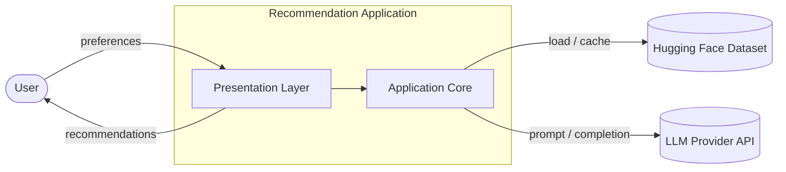
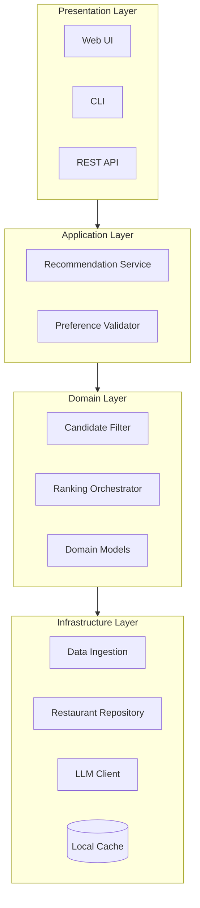
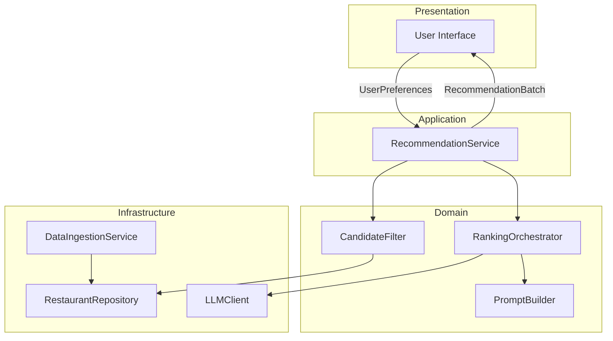
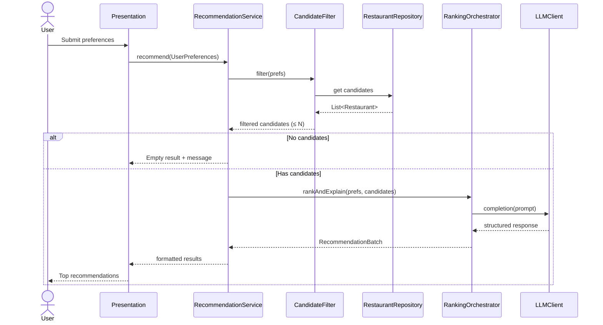
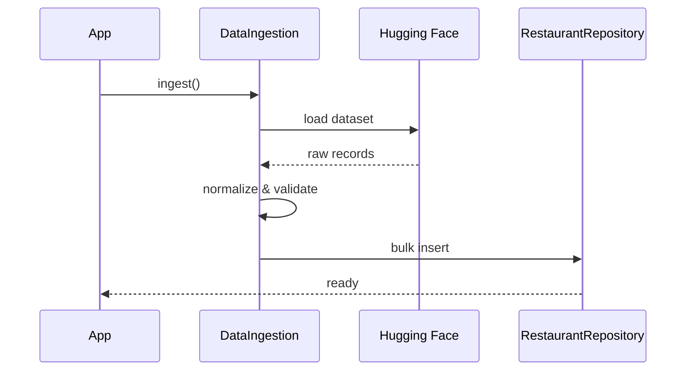

# System Architecture: AI-Powered Restaurant Recommendation System

This document defines the technical architecture for the Zomato-inspired restaurant recommendation service. It expands on [`context.md`](./context.md) with component boundaries, data flows, interfaces, and implementation guidance.

---

## 1. Architectural Goals

| Goal | How the architecture supports it |
|------|----------------------------------|
| **Personalization** | User preferences drive deterministic filtering; LLM ranks and explains matches |
| **Grounding in real data** | All recommendations originate from the Hugging Face Zomato dataset—no hallucinated venues |
| **Explainability** | LLM outputs per-restaurant rationale tied to user-stated preferences |
| **Maintainability** | Clear separation: ingestion, filtering, LLM orchestration, presentation |
| **Extensibility** | Swappable LLM provider, UI layer, and optional vector search without rewriting core logic |

---

## 2. High-Level System Context

The system sits between a **user** (supplying preferences), an **external dataset** (Hugging Face), and an **LLM API** (ranking and natural-language generation).



**External dependencies**

| Dependency | Role |
|------------|------|
| [ManikaSaini/zomato-restaurant-recommendation](https://huggingface.co/datasets/ManikaSaini/zomato-restaurant-recommendation) | Source of truth for restaurant records |
| LLM provider (e.g. OpenAI, Anthropic, local Ollama) | Ranking, explanations, optional summary |

---

## 3. Layered Architecture

The application follows a **four-layer** model. Dependencies point inward: Presentation → Application → Domain → Infrastructure.



### 3.1 Presentation Layer

Responsible for collecting user input and rendering results.

| Surface | Responsibility | When to use |
|---------|----------------|-------------|
| **Web UI** | Forms for location, budget, cuisine, rating; cards for results | Primary demo / end-user experience |
| **CLI** | Scripted prefs + terminal output | Development, automation, CI smoke tests |
| **REST API** | `POST /recommendations` with JSON body | Integrations, mobile clients, headless use |

All surfaces map HTTP/CLI input to a single **`UserPreferences`** DTO consumed by the application layer.

### 3.2 Application Layer

Orchestrates the end-to-end recommendation use case.

- **`RecommendationService`**: Coordinates filter → LLM → response assembly
- **`PreferenceValidator`**: Normalizes and validates input (e.g. budget enum, rating range)
- **No direct LLM or dataset access**—delegates to domain and infrastructure

### 3.3 Domain Layer

Pure business logic without framework or I/O details.

- **`CandidateFilter`**: Applies hard constraints from user preferences
- **`RankingOrchestrator`**: Builds prompts, parses LLM responses into ranked `Recommendation` entities
- **Domain models**: `Restaurant`, `UserPreferences`, `Recommendation`, `RecommendationBatch`

### 3.4 Infrastructure Layer

Implements ports defined by the domain/application layers.

- **`DataIngestion`**: Download/load Hugging Face dataset, normalize schema
- **`RestaurantRepository`**: In-memory or persisted query interface over restaurant records
- **`LLMClient`**: Adapter for chosen provider (chat completions, structured output)
- **`Cache`**: Optional disk/memory cache for dataset and LLM responses

---

## 4. Component Architecture



### 4.1 Data Ingestion Service

**Purpose**: Load, clean, and persist restaurant data from Hugging Face.

| Step | Action |
|------|--------|
| 1 | Fetch dataset via `datasets` library or Hugging Face Hub API |
| 2 | Map raw columns to internal `Restaurant` schema |
| 3 | Normalize text (trim, case-fold location/cuisine for matching) |
| 4 | Parse cost into numeric range or budget tier (`low` / `medium` / `high`) |
| 5 | Validate ratings; drop or flag invalid rows |
| 6 | Store in repository (in-memory list, SQLite, or Parquet on disk) |

**Outputs**: Populated `RestaurantRepository` ready for filtering.

**Operational note**: Run ingestion once at startup or on a schedule; avoid re-downloading on every user request.

### 4.2 Restaurant Repository

**Purpose**: Abstract read access to restaurant records.

```text
interface RestaurantRepository {
  findAll(): List<Restaurant>
  findByLocation(location: string): List<Restaurant>
  // Optional: findByFilters(partial criteria) for DB-backed indexes
}
```

For MVP, an in-memory list after ingestion is sufficient. Scale-up path: SQLite with indexes on `location`, `cuisine`, `rating`, `budget_tier`.

### 4.3 Candidate Filter

**Purpose**: Reduce the full dataset to a **bounded candidate set** before LLM invocation (cost, latency, context-window limits).

| Preference | Filter strategy |
|------------|-----------------|
| **Location** | Exact or fuzzy match on city/area field |
| **Budget** | Map `low` / `medium` / `high` to cost thresholds; exclude out-of-range |
| **Cuisine** | Substring or token match on cuisine field (may be multi-value) |
| **Minimum rating** | `rating >= min_rating` |
| **Additional** (family-friendly, quick service) | Keyword match on description/tags if present; else pass as soft signal to LLM only |

**Candidate cap**: If matches exceed N (e.g. 20–50), sort by rating and take top N before sending to the LLM.

### 4.4 Ranking Orchestrator & Prompt Builder

**Purpose**: Turn filtered candidates + user preferences into a ranked, explained result set.

**Responsibilities**

1. **`PromptBuilder`**: Assemble system + user messages with structured candidate JSON
2. **`LLMClient`**: Send prompt; request JSON or markdown-structured response
3. **Response parser**: Map LLM output to `List<Recommendation>`; validate restaurant IDs exist in candidate set
4. **Fallback**: If LLM fails or returns invalid IDs, fall back to rating-sorted list with template explanations

### 4.5 LLM Client

**Purpose**: Provider-agnostic interface for completions.

```text
interface LLMClient {
  complete(request: LLMRequest): LLMResponse
}
```

**Configuration**: API key via environment variable; model name, temperature, max tokens in config file.

**Recommendation**: Use **low temperature** (0.2–0.4) for stable ranking; optionally **structured output** / JSON mode to simplify parsing.

### 4.6 Presentation / Output Formatter

**Purpose**: Map `RecommendationBatch` to UI/API response.

Each item displays:

- Restaurant name  
- Cuisine  
- Rating  
- Estimated cost  
- AI-generated explanation  

Optional batch-level **summary** paragraph from the LLM.

---

## 5. Data Models

### 5.1 Restaurant (canonical record)

| Field | Type | Notes |
|-------|------|-------|
| `id` | string | Stable identifier (generated if not in dataset) |
| `name` | string | Display name |
| `location` | string | City / area |
| `cuisine` | string | May be comma-separated |
| `cost` | number or string | Raw from dataset; normalized to display + `budget_tier` |
| `budget_tier` | enum | `low` \| `medium` \| `high` (derived) |
| `rating` | float | Normalized 0–5 or dataset scale |
| `metadata` | object | Optional: tags, description for soft preferences |

### 5.2 UserPreferences

| Field | Type | Required |
|-------|------|----------|
| `location` | string | Yes |
| `budget` | enum: low \| medium \| high | Yes |
| `cuisine` | string | Yes |
| `min_rating` | float | Yes |
| `additional_preferences` | string | No |

### 5.3 Recommendation

| Field | Type | Source |
|-------|------|--------|
| `restaurant` | Restaurant | Repository (must match filtered candidate) |
| `rank` | int | LLM |
| `explanation` | string | LLM |
| `score` | float | Optional; LLM or heuristic |

### 5.4 RecommendationBatch

| Field | Type |
|-------|------|
| `recommendations` | List\<Recommendation\> |
| `summary` | string (optional) |
| `preferences_used` | UserPreferences |
| `candidates_considered` | int |

---

## 6. End-to-End Request Flow



### 6.1 Startup / cold path



---

## 7. Integration Layer (Detailed)

The integration layer is the **bridge between structured data and the LLM**. It is not a separate deployable service in the MVP; it is implemented as **`CandidateFilter` + `PromptBuilder` + `RankingOrchestrator`**.

### 7.1 Filtering pipeline

```text
All restaurants
    → location match
    → budget tier match
    → cuisine match
    → min_rating filter
    → cap to top N by rating
    → candidate list for LLM
```

### 7.2 Prompt contract

The prompt must include:

1. **Role**: Expert dining recommender for Indian cities (Zomato-style)  
2. **User preferences**: Full `UserPreferences` object (including additional text)  
3. **Candidates**: JSON array of `{ id, name, location, cuisine, rating, cost }` — only IDs from this list may appear in output  
4. **Tasks**: Rank top K (e.g. 5); explain each; optional one-paragraph summary  
5. **Constraints**: Do not invent restaurants; cite preference alignment in explanations  

### 7.3 Example response shape (LLM → parser)

```json
{
  "summary": "Based on your preference for Italian in Delhi with a medium budget...",
  "recommendations": [
    {
      "restaurant_id": "abc123",
      "rank": 1,
      "explanation": "Highly rated Italian spot in central Delhi within your budget..."
    }
  ]
}
```

Parser validates every `restaurant_id` against the candidate set before returning to the user.

---

## 8. Recommendation Engine Behavior

| Capability | Owner | Notes |
|------------|-------|-------|
| **Hard filtering** | CandidateFilter | Deterministic, reproducible |
| **Ranking** | LLM | Subjective fit, tie-breaking, soft preferences |
| **Explanations** | LLM | Natural language tied to user prefs |
| **Summary** | LLM (optional) | Batch-level overview |
| **Fallback ranking** | Domain | Sort by rating if LLM unavailable |

**Anti-hallucination**: Post-process LLM output; reject unknown IDs; optionally re-prompt once on validation failure.

---

## 9. Suggested Module / Directory Layout

```text
zomato-recommender/
├── docs/
│   ├── problemStatement.txt
│   ├── context.md
│   └── architecture.md
├── src/
│   ├── presentation/       # UI, API routes, CLI
│   ├── application/        # RecommendationService, validators
│   ├── domain/             # Models, CandidateFilter, RankingOrchestrator
│   └── infrastructure/     # Ingestion, Repository, LLMClient, config
├── data/                   # Cached dataset (gitignored)
├── tests/
│   ├── unit/               # Filter, parser, prompt builder
│   └── integration/        # Mock LLM, sample dataset slice
├── .env.example
└── README.md
```

Language-agnostic layout; implement in Python (FastAPI + Streamlit), Node, or Java per team preference.

---

## 10. Technology Stack (Recommended)

| Concern | Suggested choice | Rationale |
|---------|------------------|-----------|
| Language | Python 3.11+ | Strong Hugging Face `datasets` support |
| Dataset load | `datasets` + `huggingface_hub` | Native HF integration per context |
| API | FastAPI | Lightweight, OpenAPI docs |
| UI (demo) | Streamlit or React | Fast preference forms + result cards |
| LLM | OpenAI / Azure OpenAI / Ollama | Configurable via `LLMClient` adapter |
| Persistence (optional) | SQLite + SQLAlchemy | Simple local cache of ingested rows |
| Config | `pydantic-settings` + `.env` | Secrets outside code |

---

## 11. Deployment Views

### 11.1 Local development

```text
[Developer machine]
  ├── App process (API + UI)
  ├── Local dataset cache (data/)
  └── LLM API (cloud or local Ollama)
```

### 11.2 Single-container (demo)

```text
[Docker container]
  ├── Pre-baked dataset snapshot OR download on first run
  ├── FastAPI + static UI
  └── Env: HF_TOKEN (optional), LLM_API_KEY
```

### 11.3 Production-oriented (future)

```text
[Load balancer] → [API replicas]
                        ├── Shared DB / object store (restaurant cache)
                        └── LLM gateway (rate limit, retry, caching)
```

---

## 12. Cross-Cutting Concerns

### 12.1 Configuration

| Variable | Purpose |
|----------|---------|
| `LLM_API_KEY` | Provider authentication |
| `LLM_MODEL` | Model identifier |
| `MAX_CANDIDATES` | Cap passed to LLM (default 30) |
| `TOP_K_RESULTS` | Number of recommendations shown (default 5) |
| `DATA_CACHE_PATH` | Local path for ingested data |

### 12.2 Error handling

| Failure | Behavior |
|---------|----------|
| Dataset download fails | Fail startup with clear log; use cached copy if present |
| Zero filter matches | Return empty state; suggest relaxing criteria |
| LLM timeout / error | Fallback to rating-based ranking + generic explanation template |
| Invalid LLM JSON | Single retry with “respond only in JSON”; then fallback |

### 12.3 Observability

- Log: preference payload (redacted if needed), candidate count, LLM latency, token usage  
- Metrics (optional): requests/sec, filter match rate, LLM error rate  

### 12.4 Security

- Never commit API keys; use `.env` and secret managers in production  
- Sanitize user `additional_preferences` before embedding in prompts (prompt injection awareness)  
- Rate-limit public API if exposed  

### 12.5 Performance

| Technique | Benefit |
|-----------|---------|
| Ingest once, cache locally | Avoid HF round-trip per request |
| Candidate cap | Smaller prompts, lower cost |
| Optional LLM response cache | Same prefs + same candidate hash → reuse (short TTL) |

---

## 13. Testing Strategy

| Layer | Focus |
|-------|--------|
| **Unit** | Budget tier mapping, filter logic, JSON parser, prompt template rendering |
| **Integration** | Ingestion on dataset sample; full flow with mocked `LLMClient` |
| **E2E** | UI/API happy path; empty results; LLM failure fallback |
| **LLM eval (manual)** | Explanation quality, no hallucinated venues, preference alignment |

---

## 14. Mapping to Context Workflow

| Context workflow step | Architecture components |
|-----------------------|-------------------------|
| 1. Data Ingestion | `DataIngestionService`, `RestaurantRepository` |
| 2. User Input | Presentation layer → `UserPreferences` |
| 3. Integration Layer | `CandidateFilter`, `PromptBuilder` |
| 4. Recommendation Engine | `RankingOrchestrator`, `LLMClient` |
| 5. Output Display | Presentation formatters, `RecommendationBatch` |

---

## 15. Success Criteria (Architecture-Level)

- [ ] Single orchestrated path from preferences to `RecommendationBatch`  
- [ ] All displayed restaurants exist in the ingested dataset  
- [ ] Hard filters applied before any LLM call  
- [ ] LLM outputs parsed and validated; fallback path defined  
- [ ] Each result includes name, cuisine, rating, cost, and explanation  
- [ ] LLM provider and UI are swappable without changing domain rules  

---

## References

- Project context: [`docs/context.md`](./context.md)  
- Original requirements: [`docs/problemStatement.txt`](./problemStatement.txt)  
- Dataset: https://huggingface.co/datasets/ManikaSaini/zomato-restaurant-recommendation
