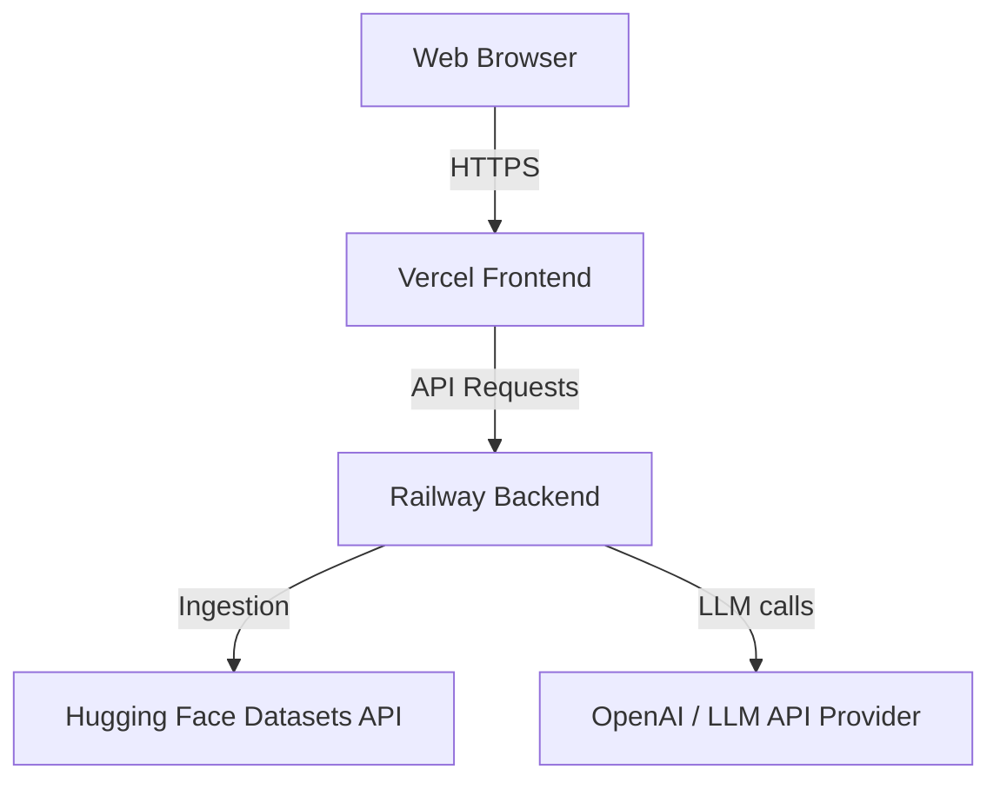

# Deployment Plan - Railway & Vercel

This document outlines the infrastructure and configuration plan for deploying the Zomato AI Restaurant Recommender.

## Target Infrastructure



- **Frontend**: Hosted on **Vercel** (Static site hosting for the React/Vite app).
- **Backend**: Hosted on **Railway** (Containerized FastAPI service).

---

## 1. Backend Deployment (Railway)

### Preparation
The backend is configured to use the following environment variables (which must be set in the Railway dashboard):
- `PORT`: Automatically injected by Railway.
- `LLM_PROVIDER`: Set to `openai` (or `mock` for testing without API keys).
- `LLM_API_KEY`: Your OpenAI API key (if using `openai` provider).
- `LLM_MODEL`: e.g., `gpt-4o-mini` (defaults to this if unset).

### Configuration Files
- **[Procfile](file:///c:/AS/PM/Projects/Zomato/Procfile)**: Tells Railway how to run the web process.
  ```yaml
  web: PYTHONPATH=src uvicorn presentation.api:app --host 0.0.0.0 --port $PORT
  ```

### Steps to Deploy on Railway:
1. Log in to the [Railway Dashboard](https://railway.app/).
2. Click **New Project** -> **Deploy from GitHub repo**.
3. Select your repository `aanishasethi2028/buildingHours_NextLeap_Zomato`.
4. Railway will automatically detect the Python environment.
5. In the **Variables** tab of the service, add the environment variables:
   - `LLM_PROVIDER`: `openai`
   - `LLM_API_KEY`: `<your_openai_api_key>`
6. The backend will build and start. Copy the generated domain (e.g. `https://xxx.up.railway.app`).

---

## 2. Frontend Deployment (Vercel)

### Preparation
The frontend relies on the environment variable `VITE_API_BASE_URL` to point to the FastAPI backend.
- `VITE_API_BASE_URL`: Set to the Railway application URL (e.g., `https://xxx.up.railway.app`).

### Configuration Files
- **[vercel.json](file:///c:/AS/PM/Projects/Zomato/frontend/vercel.json)**:
  ```json
  {
    "rewrites": [
      { "source": "/(.*)", "destination": "/index.html" }
    ]
  }
  ```

### Steps to Deploy on Vercel:
1. Log in to the [Vercel Dashboard](https://vercel.com/).
2. Click **Add New** -> **Project**.
3. Import your repository `aanishasethi2028/buildingHours_NextLeap_Zomato`.
4. Configure the project settings:
   - **Framework Preset**: `Vite`
   - **Root Directory**: `frontend`
   - **Build Command**: `npm run build`
   - **Output Directory**: `dist`
5. Under **Environment Variables**, add:
   - Key: `VITE_API_BASE_URL`
   - Value: `<your-railway-app-url>`
6. Click **Deploy**. Vercel will build and host the frontend.
