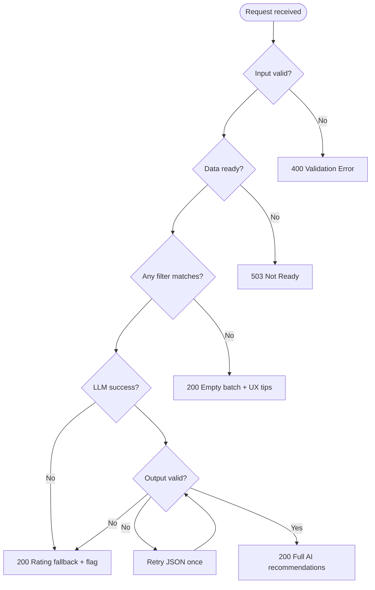

# Edge Cases & Handling Guide

This document catalogs edge cases across the restaurant recommendation system. Each entry defines the **scenario**, **expected behavior**, and **implementation notes** so developers and testers can handle failures consistently.

Derived from [`context.md`](./context.md), [`architecture.md`](./architecture.md), and [`implementation-plan.md`](./implementation-plan.md).

---

## How to Use This Document

| Column / section | Meaning |
|------------------|---------|
| **ID** | Stable reference for tests and issues (e.g. `EC-DATA-03`) |
| **Severity** | `Critical` — wrong/missing data or security; `High` — broken flow; `Medium` — degraded UX; `Low` — cosmetic or rare |
| **Layer** | Where the case is detected or handled |
| **Behavior** | What the system must do (not optional unless marked) |

**Resolution order:** Validate input → filter data → call LLM → validate LLM output → format response. Fail fast at the earliest appropriate layer.

---

## 1. Data Ingestion & Dataset

| ID | Scenario | Severity | Expected behavior | Implementation notes |
|----|----------|----------|-------------------|-------------------|
| EC-DATA-01 | Hugging Face download fails (network, 404, rate limit) | Critical | On startup: if local cache exists, load cache and log warning; if no cache, fail startup with clear error | Retry with backoff (max 3); document offline ingest script |
| EC-DATA-02 | Dataset schema changed (column renamed/removed) | Critical | Ingestion fails with mapping error listing missing columns; do not silently skip required fields | Version-pin dataset revision; add schema validation step in Phase 1 |
| EC-DATA-03 | Empty dataset after load | Critical | Fail startup: "No restaurants available" | Assert `len(repository) > 0` after ingest |
| EC-DATA-04 | Row missing required field (name, location) | High | Skip row; increment `skipped_count` in logs | Optional: store skipped rows in debug file |
| EC-DATA-05 | Duplicate restaurant names in same location | Medium | Assign unique `id` per row (hash or index); do not merge unless business rule defined | IDs must be stable across re-ingest if possible |
| EC-DATA-06 | `rating` null, non-numeric, or out of range (e.g. &gt; 5 or negative) | High | Drop row or set `rating = null` and exclude from rating-based filters | Document chosen policy in ingestion README |
| EC-DATA-07 | `cost` missing or unparseable ("-", "N/A", empty) | High | Set `cost` display to "Not available"; derive `budget_tier` as `unknown` and exclude from budget filter OR treat as pass-through with warning | Prefer excluding from strict budget filter |
| EC-DATA-08 | `cost` in unexpected format ("₹500 for two", "500-800") | Medium | Best-effort parse to numeric midpoint; log parse failures | Unit tests for common Indian cost strings |
| EC-DATA-09 | `cuisine` empty or only whitespace | Medium | Set cuisine to `"Unknown"`; may fail cuisine filter for specific requests | |
| EC-DATA-10 | `location` inconsistent ("Delhi", "New Delhi", "delhi ncr") | High | Normalize to canonical city keys during ingest; maintain alias map | Fuzzy match at filter time using same normalization |
| EC-DATA-11 | Corrupt local cache file | High | Delete corrupt cache and re-download; if download fails, see EC-DATA-01 | Validate JSON/Parquet on read |
| EC-DATA-12 | Cache stale (dataset updated on HF) | Low | Optional `CACHE_TTL` or manual `force_refresh` flag | Default: use cache until forced refresh |
| EC-DATA-13 | Partial ingest interrupted (disk full mid-write) | High | Do not load partial cache; re-run full ingest | Write to temp file then atomic rename |
| EC-DATA-14 | Very large dataset (memory pressure) | Medium | Stream/batch ingest; optional dev mode `MAX_ROWS` env | Document memory requirements |

---

## 2. User Input & Validation

| ID | Scenario | Severity | Expected behavior | Implementation notes |
|----|----------|----------|-------------------|-------------------|
| EC-INPUT-01 | Missing required field (location, budget, cuisine, min_rating) | High | Return `400` / validation error listing missing fields; do not call filter or LLM | `PreferenceValidator` before service |
| EC-INPUT-02 | Empty string for required text fields | High | Treat as missing; same as EC-INPUT-01 | Trim whitespace first |
| EC-INPUT-03 | Invalid `budget` (not `low` \| `medium` \| `high`) | High | Reject with allowed values in error message | Case-insensitive normalize then validate |
| EC-INPUT-04 | `min_rating` non-numeric | High | Reject with clear message | |
| EC-INPUT-05 | `min_rating` &lt; 0 or &gt; 5 (or dataset max) | High | Clamp to [0, 5] OR reject — **pick one and document** | Recommend reject to avoid user confusion |
| EC-INPUT-06 | `min_rating` = 5.0 (very strict) | Medium | May yield zero results; return empty state (EC-FILTER-01) | |
| EC-INPUT-07 | Location not in dataset (e.g. "Paris") | High | Zero filter matches; empty state with suggestions | Suggest available cities from distinct locations |
| EC-INPUT-08 | Location typo ("Banglore") | Medium | Fuzzy match if alias map exists; else zero matches with "Did you mean?" | Optional Levenshtein on city list |
| EC-INPUT-09 | Cuisine typo or rare cuisine not in data | High | Zero or few matches; empty or partial results | Suggest popular cuisines for selected city |
| EC-INPUT-10 | `additional_preferences` very long (&gt; 2000 chars) | Medium | Truncate to max length (e.g. 500) with log warning | Prevents token blow-up and injection surface |
| EC-INPUT-11 | `additional_preferences` only whitespace | Low | Treat as empty / omit from prompt | |
| EC-INPUT-12 | Prompt injection in additional prefs ("ignore instructions…") | Critical | Sanitize: strip control chars, limit length; system prompt forbids overriding rules; never execute user text as code | See EC-SEC-01 |
| EC-INPUT-13 | Special characters / Unicode in all text fields | Medium | Accept UTF-8; normalize NFC; escape for JSON in prompts | Test emoji and Devanagari city names |
| EC-INPUT-14 | SQL/command injection in API fields | Critical | No raw SQL from user input; parameterized queries only; Pydantic validation | N/A if in-memory only |
| EC-INPUT-15 | Concurrent duplicate requests from same user | Low | Each request independent; optional debounce in UI only | |

---

## 3. Filtering & Candidate Selection

| ID | Scenario | Severity | Expected behavior | Implementation notes |
|----|----------|----------|-------------------|-------------------|
| EC-FILTER-01 | Zero restaurants match all hard filters | High | Return empty `RecommendationBatch`; **do not call LLM**; UI message: relax location, budget, cuisine, or rating | Include `suggestions: ["lower min_rating", "try nearby city"]` |
| EC-FILTER-02 | Matches exist but all lack valid rating for `min_rating` | High | Same as EC-FILTER-01 | |
| EC-FILTER-03 | Matches &gt; `MAX_CANDIDATES` | Medium | Keep top N by rating (descending); log original count | N from config (default 30) |
| EC-FILTER-04 | Exactly 1 candidate | Medium | Skip LLM optional: can call LLM for explanation only OR use template explanation | LLM still valid for personalization text |
| EC-FILTER-05 | Candidates &lt; `TOP_K_RESULTS` (e.g. 2 matches, K=5) | Medium | Return all available; do not pad with fake entries | UI shows "2 of 5 slots" |
| EC-FILTER-06 | Budget filter excludes all but cuisine/location match | High | Empty state; suggest trying adjacent budget tier | |
| EC-FILTER-07 | Multi-cuisine restaurant string ("Italian, Pizza, Fast Food") | Medium | User cuisine "Italian" matches substring | Case-insensitive token match |
| EC-FILTER-08 | User cuisine "italian" vs data "Italian" | Low | Case-insensitive match | |
| EC-FILTER-09 | Additional prefs "family-friendly" but no tags in dataset | Medium | Hard filter cannot apply; pass preference only to LLM as soft signal | Document in UI: "soft preference" |
| EC-FILTER-10 | All candidates have `budget_tier = unknown` | Medium | Budget filter excludes all → empty or warn user | |
| EC-FILTER-11 | Location filter too broad (user enters "India") | Medium | If matches thousands, cap applies; may dilute quality | Encourage specific city in UI placeholder |
| EC-FILTER-12 | Conflicting prefs (low budget + min_rating 4.8 in expensive area) | Medium | Empty or few results; explain in empty state | |

---

## 4. LLM Integration & Prompting

| ID | Scenario | Severity | Expected behavior | Implementation notes |
|----|----------|----------|-------------------|-------------------|
| EC-LLM-01 | `LLM_API_KEY` missing or invalid | Critical | Use fallback ranking (rating sort + template explanations); log error; UI badge "AI unavailable" | Never expose key in error to client |
| EC-LLM-02 | LLM API timeout | High | Single retry with shorter candidate list OR immediate fallback | Configurable timeout (e.g. 30s) |
| EC-LLM-03 | Rate limit (429) | High | Exponential backoff, max 2 retries; then fallback | |
| EC-LLM-04 | Model not found / deprecated | High | Fail with config hint; fallback if alternate model env set | |
| EC-LLM-05 | Response not valid JSON | High | Retry once with "respond ONLY with JSON"; then fallback | |
| EC-LLM-06 | JSON valid but missing `recommendations` array | High | Fallback | |
| EC-LLM-07 | LLM returns fewer than K items | Medium | Return what was returned; backfill from rating sort if needed | |
| EC-LLM-08 | LLM returns more than K items | Low | Truncate to top K by `rank` field | |
| EC-LLM-09 | Duplicate `restaurant_id` in LLM response | Medium | Deduplicate; keep first rank | |
| EC-LLM-10 | `restaurant_id` not in candidate set (hallucination) | Critical | Drop invalid entries; if &lt; K valid remain, backfill from candidates by rating | Log hallucination count |
| EC-LLM-11 | Valid ID but wrong rank order | Low | Re-sort by `rank` before display | |
| EC-LLM-12 | Empty `explanation` for an item | Medium | Use template: "Matches your preferences for {cuisine} in {location}." | |
| EC-LLM-13 | Explanation contradicts data (claims 5★ but rating is 3.2) | Medium | Optional post-check: flag in logs; still show data fields from repository as source of truth | Display rating from DB not LLM |
| EC-LLM-14 | Token limit exceeded (too many candidates) | High | Reduce `MAX_CANDIDATES`; retry; else fallback | Monitor prompt token estimate |
| EC-LLM-15 | LLM returns markdown/code fence around JSON | Medium | Strip fences in parser before `json.loads` | |
| EC-LLM-16 | Partial response / stream interrupted | High | Treat as failure → fallback | |
| EC-LLM-17 | `summary` field missing | Low | Omit summary in UI | Optional field |
| EC-LLM-18 | Non-English explanations | Low | Accept if readable; optional prompt "respond in English" | |
| EC-LLM-19 | Ollama/local LLM not running | High | Same as EC-LLM-01 with connection error message | Health check on startup optional |

---

## 5. Application Orchestration

| ID | Scenario | Severity | Expected behavior | Implementation notes |
|----|----------|----------|-------------------|-------------------|
| EC-APP-01 | `RecommendationService.recommend()` called before ingestion complete | Critical | Block or return `503 Service Unavailable` | App state: `ready` flag |
| EC-APP-02 | Repository empty at runtime | Critical | `503` with message to run ingestion | |
| EC-APP-03 | Exception in filter layer | High | Catch; return `500` with generic message; log stack trace server-side | |
| EC-APP-04 | Exception in LLM layer after valid candidates | High | Fallback path must still return 200 with degraded flag | Never return empty if candidates exist |
| EC-APP-05 | `RecommendationBatch` with `candidates_considered = 0` | High | Must not invoke LLM | Assert in service |
| EC-APP-06 | Idempotent repeat request (same prefs) | Low | Same logical results; optional cache | |

---

## 6. Presentation & API

| ID | Scenario | Severity | Expected behavior | Implementation notes |
|----|----------|----------|-------------------|-------------------|
| EC-UI-01 | User submits form twice quickly | Medium | Disable button during load; ignore duplicate in-flight | |
| EC-UI-02 | LLM takes &gt; 10s | Medium | Show spinner/skeleton; optional cancel | |
| EC-UI-03 | `cost` is null in data | Medium | Display "Cost not available" — never blank card | |
| EC-UI-04 | Very long restaurant name or explanation | Low | Truncate display with "Read more" or CSS ellipsis | Full text in API |
| EC-UI-05 | XSS in restaurant name from dataset | Critical | Escape HTML in UI; CSP headers | Dataset could contain malicious strings |
| EC-UI-06 | API `Content-Type` not JSON | Medium | `415 Unsupported Media Type` | |
| EC-UI-07 | Malformed JSON body | High | `400` with parse error detail | |
| EC-UI-08 | Extra unknown fields in request JSON | Low | Ignore per Pydantic `model_config extra=ignore` | |
| EC-UI-09 | Mobile narrow viewport | Low | Responsive cards; readable typography | |
| EC-UI-10 | Fallback mode active | Medium | Show non-blocking notice: "Showing rating-based picks (AI offline)" | |

---

## 7. Configuration & Infrastructure

| ID | Scenario | Severity | Expected behavior | Implementation notes |
|----|----------|----------|-------------------|-------------------|
| EC-CFG-01 | Invalid `MAX_CANDIDATES` (0 or negative) | High | Default to 30 at startup; log warning | |
| EC-CFG-02 | `TOP_K_RESULTS` &gt; `MAX_CANDIDATES` | Medium | Cap TOP_K to MAX_CANDIDATES; log warning | |
| EC-CFG-03 | `DATA_CACHE_PATH` not writable | High | Fail startup or fall back to temp dir | |
| EC-CFG-04 | Missing `.env` in development | Medium | Use documented defaults; LLM calls fail → fallback | |
| EC-CFG-05 | Wrong type in env (e.g. MAX_CANDIDATES=abc) | High | Fail fast at config load with validation error | Pydantic settings |

---

## 8. Security & Abuse

| ID | Scenario | Severity | Expected behavior | Implementation notes |
|----|----------|----------|-------------------|-------------------|
| EC-SEC-01 | Prompt injection via preferences | Critical | Sanitize input; hardened system prompt; no tool execution from user text | |
| EC-SEC-02 | API key leaked in client-side code | Critical | Keys server-side only; never in Streamlit secrets in repo | |
| EC-SEC-03 | High request volume / DoS | High | Rate limit per IP (if public API); max body size | |
| EC-SEC-04 | Logged prompts contain PII | Medium | Redact or hash user free text in production logs | |
| EC-SEC-05 | SSRF via custom dataset URL (if ever added) | Critical | Disallow user-supplied URLs; fixed HF dataset only | |

---

## 9. Performance & Concurrency

| ID | Scenario | Severity | Expected behavior | Implementation notes |
|----|----------|----------|-------------------|-------------------|
| EC-PERF-01 | First request after cold start slow | Medium | Warm ingestion at startup; show "Loading data…" | |
| EC-PERF-02 | Many parallel LLM requests | High | Queue or limit concurrency; avoid API ban | Default: sync single-flight for demo |
| EC-PERF-03 | Prompt size near model context window | High | Enforce `MAX_CANDIDATES`; trim candidate fields in prompt | |
| EC-PERF-04 | Memory leak on repeated requests | Medium | No unbounded caches without TTL | |

---

## 10. Deployment & Operations

| ID | Scenario | Severity | Expected behavior | Implementation notes |
|----|----------|----------|-------------------|-------------------|
| EC-OPS-01 | Docker container has no network for HF | High | Bake dataset into image or mount volume | |
| EC-OPS-02 | Container restart loses in-memory repo | High | Persist cache volume | |
| EC-OPS-03 | Clock skew / TLS errors to LLM API | Medium | Log cert errors; retry | |
| EC-OPS-04 | Health check endpoint while ingesting | Medium | Return `503` until ready | `GET /health` |

---

## Decision Matrix: Empty vs Fallback vs Error



| Situation | HTTP / UI | Call LLM? |
|-----------|-----------|-----------|
| Invalid input | 400 | No |
| Data not loaded | 503 | No |
| No filter matches | 200, empty list | No |
| LLM/parsing failure | 200, fallback list | Attempted |
| Success | 200, AI explanations | Yes |

---

## Fallback Explanation Templates

Use when LLM is unavailable or explanations are empty. Substitute `{name}`, `{cuisine}`, `{location}`, `{rating}`, `{budget}`.

```
Ranked #{rank}: {name} serves {cuisine} in {location} with a rating of {rating}. 
It fits your {budget} budget and meets your minimum rating preference.
```

```
Soft preference note: We could not verify "{additional_preferences}" in our data; 
this pick is based on rating and your stated cuisine/location/budget.
```

---

## Test Case Checklist

Map automated or manual tests to edge case IDs.

### Unit tests (required)

- [ ] EC-DATA-06, EC-DATA-07, EC-DATA-08 — normalization  
- [ ] EC-INPUT-01 through EC-INPUT-05 — validation  
- [ ] EC-FILTER-01, EC-FILTER-03, EC-FILTER-05, EC-FILTER-07 — filter  
- [ ] EC-LLM-05, EC-LLM-10, EC-LLM-15 — parser  
- [ ] EC-CFG-01, EC-CFG-02 — config  

### Integration tests (required)

- [ ] EC-FILTER-01 — empty batch, no LLM mock call  
- [ ] EC-LLM-01, EC-LLM-02 — fallback populates K results  
- [ ] EC-LLM-10 — hallucinated ID stripped and backfilled  
- [ ] EC-APP-04 — exception in LLM still returns results  

### Manual / LLM eval

- [ ] EC-LLM-13 — explanations align with displayed rating  
- [ ] EC-INPUT-12 — injection attempt does not change ranking rules  
- [ ] EC-UI-10 — fallback banner visible  

---

## Priority for MVP

Implement these first before optional polish:

| Priority | IDs |
|----------|-----|
| P0 | EC-DATA-01, EC-FILTER-01, EC-LLM-01, EC-LLM-10, EC-INPUT-01, EC-SEC-01, EC-APP-05 |
| P1 | EC-LLM-02, EC-LLM-05, EC-DATA-07, EC-INPUT-07, EC-FILTER-03, EC-UI-03, EC-UI-10 |
| P2 | EC-INPUT-08, EC-DATA-10, EC-FILTER-09, EC-LLM-12, EC-PERF-03 |
| P3 | Remaining items |

---

## References

- Architecture error handling: [`architecture.md` §12.2](./architecture.md)  
- Implementation hardening: [`implementation-plan.md` Phase 6](./implementation-plan.md)  
- Requirements: [`context.md`](./context.md)
