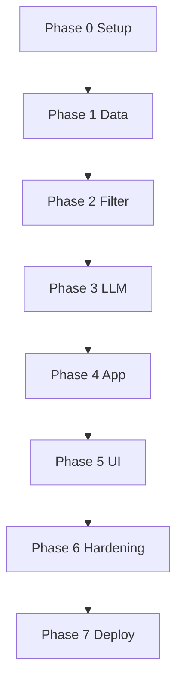
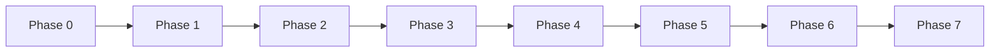

# Phase-Wise Implementation Plan

This document is the execution roadmap for the AI-powered restaurant recommendation system. It is derived from [`context.md`](./context.md) (requirements and workflow) and [`architecture.md`](./architecture.md) (components, layers, and technical decisions).

Each phase has **goals**, **tasks**, **deliverables**, **acceptance criteria**, and **dependencies**. Phases are sequential unless noted otherwise.

> **Diagrams not showing in preview?** Cursor/VS Code often does not render Mermaid (especially Gantt charts). Enable it in **Settings → search `mermaid`** and turn on Markdown Mermaid support, or paste a code block into [mermaid.live](https://mermaid.live). ASCII timelines below always display.

---

## Plan Overview



**Timeline (ASCII fallback)**

```text
Phase 0      Phase 1       Phase 2        Phase 3      Phase 4       Phase 5         Phase 6        Phase 7
 Setup   -->  Data     -->  Filter    -->  LLM     -->  App      -->  UI        -->  Hardening -->  Deploy
 ~2 days     ~4 days       ~3 days        ~5 days      ~2 days       ~4 days         ~3 days        ~2 days
```

| Phase | Name | Maps to context workflow | Primary architecture components |
|-------|------|--------------------------|--------------------------------|
| 0 | Foundation & setup | — | Project layout, config, tooling |
| 1 | Data ingestion & repository | Step 1: Data Ingestion | `DataIngestionService`, `RestaurantRepository`, `Restaurant` |
| 2 | Domain models & filtering | Step 3 (partial): Integration Layer | `UserPreferences`, `CandidateFilter` |
| 3 | LLM recommendation engine | Steps 3–4: Integration + Recommendation | `PromptBuilder`, `LLMClient`, `RankingOrchestrator` |
| 4 | Application orchestration | End-to-end glue | `RecommendationService`, `PreferenceValidator` |
| 5 | Presentation & output | Steps 2 & 5: User Input + Output Display | Web UI / API / CLI, formatters |
| 6 | Hardening & testing | Success criteria | Errors, fallbacks, tests, observability |
| 7 | Deployment & documentation | Delivery | Docker, README, demo |

**Estimated total (solo developer):** ~3–4 weeks at moderate pace. Adjust per team size and LLM provider setup time.

---

## Phase 0: Foundation & Project Setup

**Goal:** Establish repository structure, dependencies, and configuration so later phases can build on a consistent baseline.

### Tasks

| # | Task | Details |
|---|------|---------|
| 0.1 | Create directory layout | Follow [`architecture.md` §9](./architecture.md): `src/presentation`, `application`, `domain`, `infrastructure`, `tests`, `data/` |
| 0.2 | Initialize Python project | `pyproject.toml` or `requirements.txt`: Python 3.11+, `pydantic`, `pydantic-settings` |
| 0.3 | Add dev dependencies | `pytest`, `pytest-cov`, `ruff` or `black`/`isort`, optional `mypy` |
| 0.4 | Environment template | `.env.example` with `LLM_API_KEY`, `LLM_MODEL`, `MAX_CANDIDATES`, `TOP_K_RESULTS`, `DATA_CACHE_PATH` |
| 0.5 | Config module | `infrastructure/config.py` loading settings from env; no secrets in code |
| 0.6 | Git hygiene | `.gitignore` for `data/`, `.env`, `__pycache__`, virtualenv |
| 0.7 | Stub package entry | Minimal `main.py` or FastAPI app that starts and logs config (no business logic yet) |

### Deliverables

- Runnable empty project (install deps, run entrypoint)
- Documented env vars matching architecture §12.1
- README stub pointing to `docs/`

### Acceptance criteria

- [ ] `pip install -r requirements.txt` (or equivalent) succeeds
- [ ] Config loads from `.env` with sensible defaults
- [ ] Layer folders exist and are importable as packages

### Dependencies

- None (first phase)

**Indicative duration:** 1–2 days

---

## Phase 1: Data Ingestion & Repository

**Goal:** Load the Hugging Face Zomato dataset, normalize it into domain models, and expose read access via a repository. Satisfies **context workflow step 1**.

### Tasks

| # | Task | Details |
|---|------|---------|
| 1.1 | Add dataset dependencies | `datasets`, `huggingface_hub` |
| 1.2 | Inspect raw schema | Load a small split; document column mapping to internal `Restaurant` model |
| 1.3 | Implement `Restaurant` model | Fields per architecture §5.1: `id`, `name`, `location`, `cuisine`, `cost`, `budget_tier`, `rating`, `metadata` |
| 1.4 | Normalization logic | Trim strings; case-fold location/cuisine; parse cost; derive `budget_tier` (`low` / `medium` / `high`) |
| 1.5 | Rating validation | Drop or flag invalid rows; document handling |
| 1.6 | `DataIngestionService` | Fetch from [HF dataset](https://huggingface.co/datasets/ManikaSaini/zomato-restaurant-recommendation); map rows → `Restaurant` |
| 1.7 | Local cache | Persist normalized data to `data/` (JSON, Parquet, or SQLite) to avoid re-download |
| 1.8 | `RestaurantRepository` | In-memory implementation: `findAll()`, `findByLocation()`; bulk load from ingestion |
| 1.9 | Startup ingestion | On app start: load cache if fresh; else ingest and save |
| 1.10 | Unit tests | Budget tier mapping, ID generation, sample row normalization |

### Deliverables

- `src/domain/models/restaurant.py`
- `src/infrastructure/ingestion.py`
- `src/infrastructure/repository.py`
- Cached dataset under `data/` (gitignored)
- CLI script or command: `python -m scripts.ingest` (optional)

### Acceptance criteria

- [ ] Full dataset loads without unhandled errors (or documented subset for dev)
- [ ] Repository returns restaurants with all required display fields
- [ ] Second startup uses cache; no redundant HF download
- [ ] Unit tests pass for normalization edge cases

### Dependencies

- Phase 0 complete

**Indicative duration:** 3–4 days

---

## Phase 2: Domain Models, Preferences & Candidate Filter

**Goal:** Accept structured user preferences and deterministically filter restaurants before any LLM call. Covers the **hard-filter** portion of **context workflow step 3**.

### Tasks

| # | Task | Details |
|---|------|---------|
| 2.1 | `UserPreferences` model | Per architecture §5.2: location, budget, cuisine, min_rating, additional_preferences (optional) |
| 2.2 | `PreferenceValidator` | Normalize budget enum; validate min_rating range; strip/sanitize additional text |
| 2.3 | `CandidateFilter` | Pipeline: location → budget → cuisine → min_rating (architecture §7.1) |
| 2.4 | Location matching | Exact match first; optional fuzzy/normalized match for city names |
| 2.5 | Cuisine matching | Substring/token match on multi-value cuisine strings |
| 2.6 | Candidate cap | If results > `MAX_CANDIDATES`, keep top N by rating |
| 2.7 | Soft preferences handling | If dataset lacks tags, document that `additional_preferences` are deferred to LLM (Phase 3) |
| 2.8 | Empty-result behavior | Return empty list with reason metadata for UI messaging |
| 2.9 | Unit tests | Filter combinations, cap behavior, no matches, edge cases |

### Deliverables

- `src/domain/models/preferences.py`
- `src/domain/filters/candidate_filter.py`
- `src/application/preference_validator.py`
- Test fixtures: small in-memory restaurant list

### Acceptance criteria

- [ ] Given sample prefs, filter returns only matching restaurants
- [ ] Candidate count never exceeds `MAX_CANDIDATES`
- [ ] Validator rejects invalid budget/rating with clear errors
- [ ] All filter unit tests pass

### Dependencies

- Phase 1 (`RestaurantRepository` populated)

**Indicative duration:** 2–3 days

---

## Phase 3: LLM Recommendation Engine

**Goal:** Rank filtered candidates, generate explanations (and optional summary), validate LLM output, and provide a rating-based fallback. Implements **context workflow steps 3–4**.

### Tasks

| # | Task | Details |
|---|------|---------|
| 3.1 | Domain result models | `Recommendation`, `RecommendationBatch` (architecture §5.3–5.4) |
| 3.2 | `LLMClient` interface | `complete(request) -> response`; infrastructure adapter for chosen provider |
| 3.3 | Provider implementation | Groq / Ollama — configurable via env |
| 3.4 | `PromptBuilder` | System + user messages per architecture §7.2: role, prefs, candidate JSON, constraints |
| 3.5 | Structured output | Request JSON mode; document expected schema (architecture §7.3) |
| 3.6 | `RankingOrchestrator` | Build prompt → call LLM → parse response |
| 3.7 | Response parser | Map `restaurant_id`, `rank`, `explanation` to `Recommendation`; join with candidate `Restaurant` |
| 3.8 | Anti-hallucination | Reject unknown IDs; optional single retry with stricter JSON instruction |
| 3.9 | Fallback path | On LLM failure/timeout/invalid JSON: sort by rating, template explanations |
| 3.10 | Mock `LLMClient` | Fixed JSON responses for integration tests |
| 3.11 | Integration tests | Full rank flow with mock LLM; fallback triggered on error |

### Deliverables

- `src/domain/models/recommendation.py`
- `src/domain/ranking/prompt_builder.py`
- `src/domain/ranking/ranking_orchestrator.py`
- `src/infrastructure/llm/client.py` (+ provider module)
- Mock client and parser tests

### Acceptance criteria

- [ ] LLM returns top K recommendations with explanations for valid candidates
- [ ] Every returned restaurant ID exists in the input candidate set
- [ ] Fallback produces K results without calling LLM when mock throws
- [ ] Optional batch `summary` populated when LLM succeeds
- [ ] Temperature and model name read from config

### Dependencies

- Phase 2 (`CandidateFilter` output)
- LLM API key or local Ollama available for manual smoke tests

**Indicative duration:** 4–5 days

---

## Phase 4: Application Orchestration

**Goal:** Single use-case entry point wiring filter → rank → batch response. No UI yet; verifiable via tests or thin CLI.

### Tasks

| # | Task | Details |
|---|------|---------|
| 4.1 | `RecommendationService` | `recommend(UserPreferences) -> RecommendationBatch` |
| 4.2 | Orchestration flow | Validate prefs → filter → if empty return empty batch with message → else rank → assemble batch |
| 4.3 | Dependency injection | Wire repository, filter, orchestrator, config (constructor or simple factory) |
| 4.4 | Batch metadata | Set `preferences_used`, `candidates_considered` on `RecommendationBatch` |
| 4.5 | Integration test | End-to-end with mock LLM and fixture data |
| 4.6 | Minimal CLI (optional) | Accept prefs as args/JSON; print JSON results — useful before UI exists |

### Deliverables

- `src/application/recommendation_service.py`
- `src/application/factory.py` or `container.py` for wiring
- Integration test: prefs → `RecommendationBatch`

### Acceptance criteria

- [ ] One call to `recommend()` executes full backend path
- [ ] Empty filter results return structured empty batch (no LLM call)
- [ ] Integration test passes without real LLM (mock only)

### Dependencies

- Phases 1–3 complete

**Indicative duration:** 1–2 days

---

## Phase 5: Presentation & Output Display

**Goal:** Collect user preferences and display recommendations in a user-friendly format. Implements **context workflow steps 2 and 5**.

### Tasks

| # | Task | Details |
|---|------|---------|
| 5.1 | Choose primary UI | **Recommended:** Streamlit for fast demo; **Alternative:** FastAPI + simple HTML/React |
| 5.2 | Preference form | Fields: location, budget (select), cuisine, min rating, additional (textarea) |
| 5.3 | API layer (if FastAPI) | `POST /recommendations` — request/response schemas mirroring domain models |
| 5.4 | Output formatter | Map `RecommendationBatch` to UI cards: name, cuisine, rating, cost, explanation |
| 5.5 | Empty & error states | “No matches” with suggestions; LLM fallback indicator (optional subtle badge) |
| 5.6 | Loading state | Show progress while LLM runs |
| 5.7 | Summary display | Render batch-level summary when present |
| 5.8 | Wire startup | Trigger data ingestion on app boot (Phase 1) |
| 5.9 | Manual test checklist | Delhi + Italian + medium budget; edge case with zero results |

### Deliverables

- `src/presentation/streamlit_app.py` **or** `api/routes.py` + `static/`
- OpenAPI docs (if FastAPI)
- Screenshot-ready demo flow

### Acceptance criteria

- [ ] User can submit all preference fields from context.md
- [ ] Top K results show all five required fields (name, cuisine, rating, cost, explanation)
- [ ] App runs locally with documented commands in README
- [ ] API returns JSON matching UI data (if API built)

### Dependencies

- Phase 4 (`RecommendationService`)

**Indicative duration:** 3–4 days

---

## Phase 6: Hardening, Testing & Observability

**Goal:** Meet architecture success criteria and context success criteria through reliability, security basics, and automated tests.

### Tasks

| # | Task | Details |
|---|------|---------|
| 6.1 | Error handling matrix | Implement behaviors from architecture §12.2 (dataset fail, zero matches, LLM fail, bad JSON) |
| 6.2 | Logging | Log candidate count, LLM latency, errors; avoid logging raw API keys |
| 6.3 | Prompt injection mitigation | Sanitize `additional_preferences` before prompt (strip control chars, length cap) |
| 6.4 | Unit test coverage | Filter, parser, prompt builder, budget mapping — target ≥80% on domain layer |
| 6.5 | E2E test | API or CLI happy path with mock LLM |
| 6.6 | E2E edge cases | Empty filter; LLM failure → fallback |
| 6.7 | Manual LLM eval | Checklist: no fake restaurants, explanations mention user prefs |
| 6.8 | Performance smoke | Confirm ingestion not repeated per request; measure p95 latency with 30 candidates |

### Deliverables

- Expanded `tests/unit/` and `tests/integration/`
- `docs/testing.md` or section in README with manual LLM eval steps
- Logging configuration

### Acceptance criteria

- [ ] All automated tests pass in CI (or local `pytest`)
- [ ] Architecture §15 checklist items satisfied
- [ ] Context success criteria: end-to-end flow, personalized explanations, readable output
- [ ] Documented manual eval completed at least once with real LLM

### Dependencies

- Phase 5 (full stack available)

**Indicative duration:** 2–3 days

---

## Phase 7: Deployment, Documentation & Handoff

**Goal:** Package the application for reproducible runs and hand off to reviewers or stakeholders.

### Tasks

| # | Task | Details |
|---|------|---------|
| 7.1 | README | Setup, env vars, run UI/API, run tests, dataset attribution |
| 7.2 | Dockerfile (optional) | Single-container: pre-bake data or ingest on first run; expose port |
| 7.3 | `docker-compose.yml` (optional) | App + env file mount |
| 7.4 | Demo script | Example preferences for 2–3 cities/cuisines |
| 7.5 | Architecture alignment review | Verify implementation matches `architecture.md` layers |
| 7.6 | Future enhancements doc | SQLite indexes, LLM cache, rate limiting (architecture §11.3) |

### Deliverables

- Complete README
- Optional Docker assets
- Demo guide

### Acceptance criteria

- [ ] New developer can run app from README in &lt;30 minutes (given API keys)
- [ ] Optional: `docker build` && `docker run` works
- [ ] All docs cross-linked: `problemStatement.txt` → `context.md` → `architecture.md` → `implementation-plan.md`

### Dependencies

- Phase 6 complete

**Indicative duration:** 1–2 days

---

## Phase Dependency Graph

Same sequence as above (each phase depends on the previous):



```text
P0 → P1 → P2 → P3 → P4 → P5 → P6 → P7
```

---

## Requirements Traceability Matrix

| Context / problem requirement | Phase(s) |
|------------------------------|----------|
| Load HF Zomato dataset | 1 |
| Extract name, location, cuisine, cost, rating | 1 |
| Collect location, budget, cuisine, min rating, additional prefs | 2, 5 |
| Filter data by user input | 2 |
| Pass structured data to LLM prompt | 3 |
| LLM ranks and explains | 3 |
| Optional summary | 3, 5 |
| Display name, cuisine, rating, cost, explanation | 5 |
| End-to-end personalized flow | 4, 5, 6 |

| Architecture component | Phase(s) |
|------------------------|----------|
| `DataIngestionService` | 1 |
| `RestaurantRepository` | 1 |
| `CandidateFilter` | 2 |
| `PromptBuilder`, `RankingOrchestrator` | 3 |
| `LLMClient` | 3 |
| `RecommendationService` | 4 |
| Presentation (Web / API / CLI) | 4 (CLI), 5 (primary UI) |
| Error handling & fallbacks | 3, 6 |
| Config & security | 0, 6 |

---

## Risk Register & Mitigations

| Risk | Impact | Mitigation | Phase |
|------|--------|------------|-------|
| HF dataset schema differs from docs | Ingestion breaks | Inspect early; flexible column mapping | 1 |
| No rows after strict filters | Poor UX | Empty state + suggest relaxing criteria; log match counts | 2, 5 |
| LLM hallucinates restaurant IDs | Wrong recommendations | Parser validation + retry + fallback | 3 |
| LLM cost/latency high | Slow, expensive demo | Candidate cap; small TOP_K; cache (future) | 2, 3 |
| Missing API key | Cannot demo rankings | Mock client for tests; document Ollama alternative | 0, 3 |
| Prompt injection via additional prefs | Misbehavior | Sanitize input; system prompt constraints | 3, 6 |

---

## Definition of Done (Project-Level)

The project is **complete** when all of the following are true:

1. **Data:** Zomato dataset ingested, cached, and queryable via repository  
2. **Input:** User can specify location, budget, cuisine, minimum rating, and optional extras  
3. **Filter:** Hard filters run before LLM; candidate set is bounded  
4. **LLM:** Top recommendations ranked with per-item explanations; optional summary  
5. **Output:** UI or API shows name, cuisine, rating, cost, and AI explanation  
6. **Quality:** Automated tests pass; fallback works when LLM fails  
7. **Docs:** README and `docs/` set enable onboarding and review  

---

## Optional Post-MVP Phases

| Phase | Scope | Value |
|-------|--------|-------|
| 8 | SQLite persistence + indexes | Faster filters at scale |
| 9 | LLM response caching | Lower cost for repeated queries |
| 10 | REST-only + React frontend | Production-grade UI |
| 11 | Vector search on descriptions | Better soft-preference matching |
| 12 | Production deploy (K8s, rate limits, secrets manager) | Real traffic |

---

## Quick Start Checklist (Day 1)

- [ ] Complete Phase 0  
- [ ] Run Phase 1 ingestion against HF dataset; inspect 5 sample rows  
- [ ] Confirm budget tiers and locations look correct before building filters  

---

## References

- Requirements: [`docs/context.md`](./context.md)  
- Design: [`docs/architecture.md`](./architecture.md)  
- Original spec: [`docs/problemStatement.txt`](./problemStatement.txt)  
- Dataset: https://huggingface.co/datasets/ManikaSaini/zomato-restaurant-recommendation
